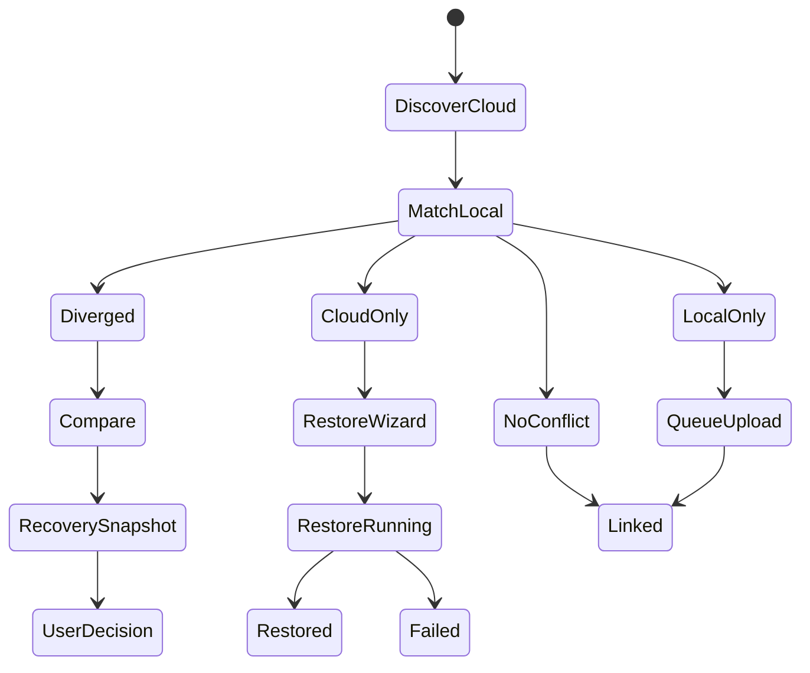

# Cloud Recovery Flow

Cloud recovery covers every case where cloud and local state can diverge. The default behavior is non-destructive: preserve both histories, create a recovery snapshot when needed, and never silently overwrite or delete user data.

## Scenario Matrix

| Scenario | Required Behavior |
|----------|-------------------|
| Local repository was deleted but cloud repository exists | Show it as cloud-only and offer Restore / Restore to... |
| User cleaned local data then logged in again | Discover cloud repositories and offer restore without assuming data loss is intentional |
| Local folder exists but repository metadata is lost | Offer relink, compare, and recovery snapshot creation |
| Local folder changed while cloud was offline | Compare cloud head with local state before upload or restore |
| Cloud has older history and local has newer files | Preserve local files, upload a new snapshot, and keep cloud history |
| Cloud has snapshots missing locally | Show cloud-only history and offer full history restore |
| Local files do not exist in cloud | Treat them as local-only and include them in recovery summary |
| Local deletions differ from cloud | Do not delete cloud silently; show deleted-local / exists-cloud conflict |
| Files changed on both sides | Require conflict resolution or safe merge with recovery snapshot |
| Restore to original path | Check path existence and conflicts before writing |
| Restore to custom path | Create repository there and link it to cloud id |
| Nested repository restore | Resolve effective ownership and do not let parent sync overwrite child repository state |
| Interrupted sync resume | Continue from checkpoint without reuploading completed blocks |
| Cloud unavailable for a long time | Keep local operations active and queue sync |
| Manual restore | Run as background operation with wizard progress |
| Manual sync | Run as background operation with queue progress |
| Automatic sync | Run in background only |
| Delete repository from cloud | Danger action with irreversible confirmation |
| Delete only cloud history | Danger action; keep local history unless separately requested |
| Restore one repository | Scope operation to selected repository |
| Restore full repository history | Restore snapshots, versions, metadata, and required blocks |

## Recovery State Machine

## Fail-Safe Rules

- Never silently overwrite local files with cloud files.
- Never silently delete cloud history because local retention removed it.
- Never treat missing local metadata as permission to delete cloud data.
- Always prefer a recovery snapshot when cloud/local divergence is detected.
- If the user is unsure, preserve both histories.

## Required Tests

- Deleted local repository restored from cloud.
- User data cleanup followed by login and discovery.
- Existing folder relink.
- Existing changed folder restore.
- Cloud-only snapshots restored locally.
- Local-only files preserved.
- Modified-on-both conflict detected.
- Interrupted sync resumes from checkpoint.
- Cloud unavailable degrades gracefully.

