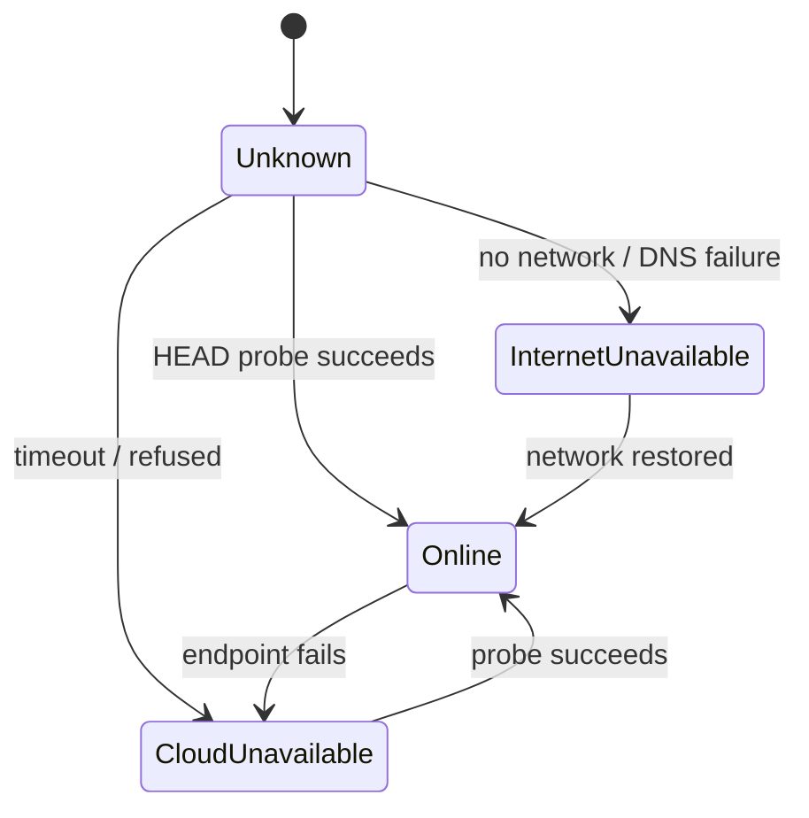
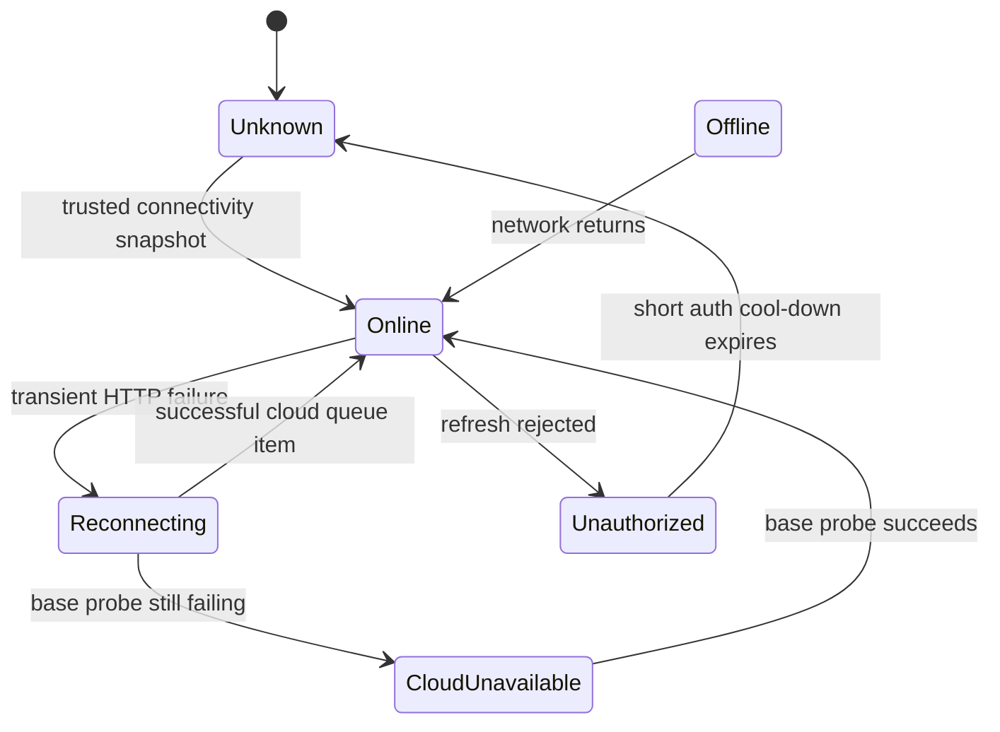

# Connectivity State Machine

VeyraFlow has two layers of connectivity state.

## Base Connectivity

`IConnectivityStatusService` probes the environment:

## Cloud Availability

`ICloudAvailabilityService` turns base connectivity plus recent sync failures into a cloud-operation decision:

## Implementation Rule

Every cloud entrypoint must check `ShouldSkipCloudOperation` before:

- token refresh
- listing cloud repositories
- probing remote blocks
- pushing snapshot metadata
- uploading/downloading blocks
- processing pending queue items

Local scan and snapshot code must not call HTTP services directly.

