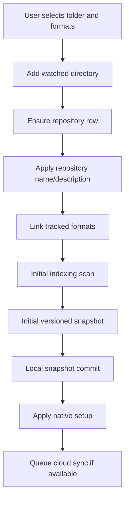

# Repository Initialization Flow

Repository initialization must be deterministic and local-first.

## Required Order

## Guarantees

- Repository creation is not considered locally complete until the initial scan finishes.
- Initial snapshot uses `TriggerOverride = "initial_snapshot"`.
- Initial snapshot creation uses a bounded retry guard for scan-in-progress races and for matched files that did not produce a versioned snapshot.
- Cloud queueing happens after local commit and must not block repository creation.
- If files are busy, the repository can still be created, but the busy-file warning must be visible.
- If the bounded initial snapshot attempts still do not produce a usable snapshot, repository creation returns the repository id with an explicit `needs retry` status instead of silently reporting a normal success.
- Exceptions during local scan or snapshot creation must not be swallowed silently.

## Race Conditions To Avoid

- Starting cloud sync before the initial local snapshot exists.
- Running native watcher setup before repository formats are linked.
- Starting a second scan while the initial scan is still active.
- Treating a cloud failure as repository creation failure.
