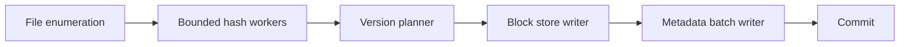

# Large Snapshot Processing

Large repositories and large media/archive files require bounded, observable processing. The goal is steady throughput without UI stalls, memory spikes, or SQLite write contention.

## Design Principles

- Use bounded concurrency for CPU/file hashing work.
- Keep SQLite writes batched and transaction-scoped.
- Avoid unbounded in-memory lists for future streaming work.
- Throttle UI progress updates.
- Isolate cloud upload from local snapshot commit.

## Current Safeguards

| Area | Safeguard |
|---|---|
| Active scans | One active scan per repository via `ActiveRepositoryScans` |
| Native execution | Scanner work runs through `INativeExecutionScheduler` |
| Snapshot entries | SQLite batch insert path |
| Snapshot links | SQLite batch insert path |
| Diff precompute | Text diff save lock stripes |
| Cloud upload | Upload checkpoints and small block batches |

## Target Producer/Consumer Shape

The writer side should apply backpressure so a huge repository cannot queue unlimited file/block work in memory.

## Observability

For production diagnostics, logs should include:

- operation id
- repository id
- trigger
- current phase
- file/block counts
- current large file path when safe to log
- phase duration
- total duration
- cloud queue status

