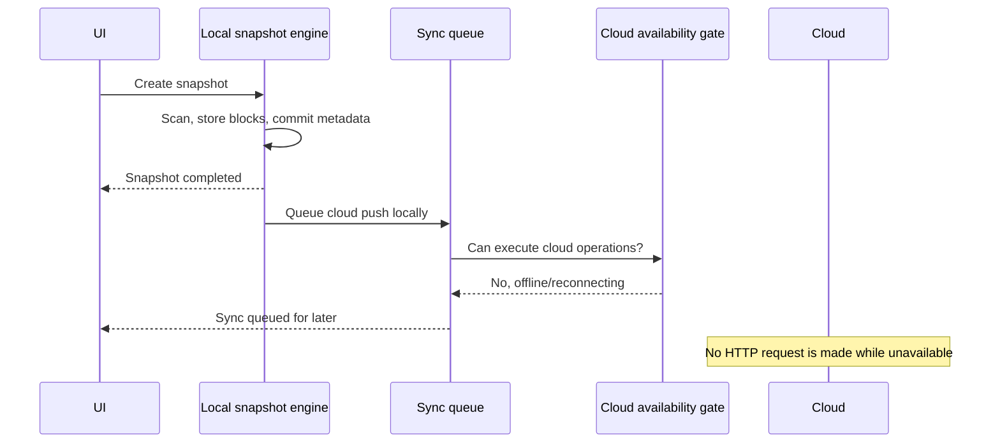

# Offline-First Architecture

VeyraFlow is local-first. The app must be useful and safe when the cloud API is down, the network is unavailable, or the user is signed out.

## Rules

- Repository creation, scans, snapshots, diffs, retention, restore from local history, and integrity checks are local operations.
- Cloud sync is optional background work.
- Cloud failures must not block local UI, local snapshot completion, or repository initialization.
- Local cleanup does not imply cloud cleanup.

## Local vs Cloud Responsibilities

| Local engine | Cloud engine |
|---|---|
| Scans repositories | Pushes committed snapshots |
| Stores local blocks | Uploads missing cloud blocks |
| Commits SQLite metadata | Resolves remote head/conflicts |
| Runs retention and cleanup | Restores cloud history on request |
| Serves file history and diffs | Reports cloud sync health |

## Offline Flow

## UX Requirements

- Show local completion separately from cloud sync state.
- Use wording like “Snapshot saved locally. Cloud sync is queued.”
- When cloud is unavailable, do not show blocking progress or fake ETA.
- Queue retry status should be visible but non-blocking.

